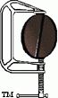

[![Build Status][travis-badge]][travis-badge-url]
[![Quality Gate][sonarqube-badge]][sonarqube-badge-url] 
[![Technical debt ratio][technical-debt-ratio-badge]][technical-debt-ratio-badge-url] 
[![Coverage][coverage-badge]][coverage-badge-url]

Fun with BCEL 
================
The Apache Common's Byte Code Engineering Library (BCEL) is a library for 
manipulating Java bytecode instructions. This project contains different
examples of BCEL.

[travis-badge]: https://travis-ci.org/indrabasak/fun-with-bcel.svg?branch=master
[travis-badge-url]: https://travis-ci.org/indrabasak/fun-with-bcel/

[sonarqube-badge]: https://sonarcloud.io/api/project_badges/measure?project=com.basaki%3Afun-with-bcel&metric=alert_status
[sonarqube-badge-url]: https://sonarcloud.io/dashboard/index/com.basaki:fun-with-bcel 

[technical-debt-ratio-badge]: https://sonarcloud.io/api/project_badges/measure?project=com.basaki%3Afun-with-bcel&metric=sqale_index
[technical-debt-ratio-badge-url]: https://sonarcloud.io/dashboard/index/com.basaki:fun-with-bcel

[coverage-badge]: https://sonarcloud.io/api/project_badges/measure?project=com.basaki%3Afun-with-bcel&metric=coverage
[coverage-badge-url]: https://sonarcloud.io/dashboard/index/com.basaki:fun-with-bcel